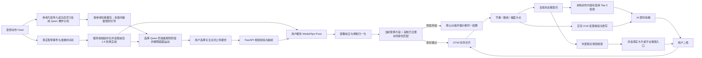

# 系统架构 v2

## 总体链路



## 与 v1 的架构差异

v1 在诊断后只返回一个教学项；v2 增加了明确的视觉搜索层：

- 输入索引：动作 ID、主要卡点、身体部位、用户关注点；
- 诊断闸门：先验证用户上传是否属于当前动作，再进行技术纠错；
- 身体分类：手势、手臂、核心/躯干、脚步、节奏、全身协调；
- 检索字段：错误类型、身体区域、视角类型、难度和标签；
- 排序：卡点匹配 > 身体部位 > 用户意图 > 内容形式；
- 多样化：优先返回不同 `view_type`，避免三个结果同质；
- 输出：搜索词、匹配原因、Top-3 内容卡。
- 内容源：`tutorial_catalog.json` 独立维护 25 条教学记录、来源、许可和可选本地路径；
- 本地教学文件：统一使用 `assets/tutorials/<tutorial-id>.mp4`，路径未登记时保持为空。

## 模型分工

- MediaPipe：连续人体关键点；手势级使用手腕及拇指/食指/小指点，不冒充逐指模型；
- OpenCV / FFmpeg：读取真实 Feed 帧并原子生成暂停上下文；
- DTW / 数值规则：计算动作差异；
- 教学内容矩阵：按动作、卡点、身体部位和教学视角决定“该看哪种内容”；
- 豆包 VLM：结合关键帧核验语境，先生成一句总体评价，再生成一个重点问题与改法；
- Qwen：只处理管理员导入的参考片段，在 Feed 导入响应后生成通用分阶段教学计划；
  超时、异常 JSON 或未配置时不影响导入和用户分析；
- 外部视频检索：通过抖音开放平台返回真实内容卡片；没有权限或接口失败时退回
  抖音精准搜索入口，不与本地拆解混为一谈。

## 部署

```text
HTTPS 域名
└── Docker / FastAPI
    ├── /api/v1/actions
    ├── /api/v1/actions/import
    ├── /api/v1/actions/{id}/pause-insight
    ├── /api/v1/actions/{id}/related-videos
    ├── /api/v1/analyze
    ├── /app/                 H5
    ├── /media/feed/          开放许可 Feed 视频
    ├── /media/covers/        保持源比例的 Feed 稳定封面
    ├── /media/references/    同源短诊断参考
    ├── /media/visualizations/
    └── /data/
        ├── actions.json       可动态扩展的动作清单
        ├── feeds/             导入的持久化 Feed
        ├── covers/            Feed 封面
        ├── references/        不可变参考代际
        └── teaching_plans/    按参考哈希缓存的 Qwen 通用教学计划
```

Qwen 教学计划不写入动作清单或 `tutorials`，不增加首页动作和教学卡片数量。用户
模仿视频仍只进入原有 MediaPipe / DTW / 豆包诊断链路，不会发送给 Qwen。
